# Instalación de Maven en el Ubuntu


## Título de la tarea

 - __Instalación de MAVEN en Ubuntu__

## Instalar Apache Maven con apt
1.	Primero hay que actualizar el sistema, para ello utilizados en siguiente comando: 

```
 sudo apt update
```
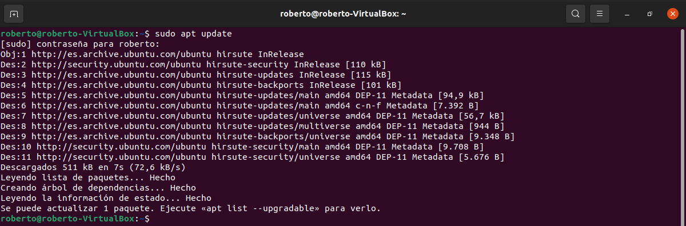

2.	Una vez finalizado procedemos a la instalación de Maven usando el siguiente comando:   

```
 sudo apt install maven
```
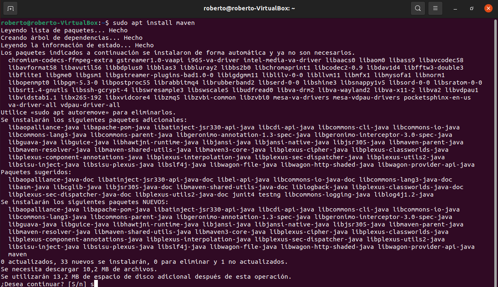
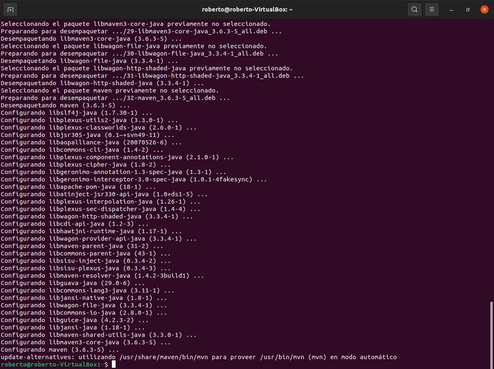

3.	Procedemos a verificar que se realizado la instalación correctamente y comprobamos la versión de Maven que tenemos instalada. Para ello utilizaremos el siguiente comando: 
```
 mvn -version
```
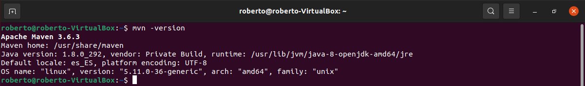

### Instalar una versión concreta de Apache Maven
Ahora procederemos a realizar la instalación de una versión especifica de Maven 3.8.2, para ello se realizan las siguientes instrucciones:
1.	Descargamos Apache Maven en el directorio /tmp, para ello usamos el siguiente comando: 

```
wget https://www.apache.org/dist/maven/maven-3/3.8.2/binaries/apache-maven-3.8.2-bin.tar.gz -P /tmp
```
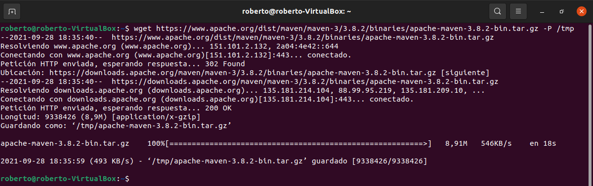

2.	Una vez que se complete la descarga se extrae el archivo en el directorio /opt, para ello usamos el siguiente comando:
```
sudo tar xf /tmp/apache-maven-*.tar.gz -C /opt
```
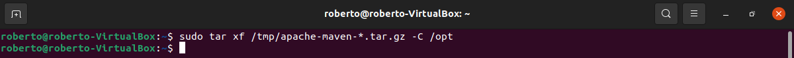

3.	A continuación, para tener más control sobre las versiones y actualización de Maven, procedemos a crear un enlace simbólico que apunta al directorio de instalación de Maven para ello usamos el siguiente comando:
```
sudo ln -s /opt/apache-maven-3.8.2 /opt/maven
```
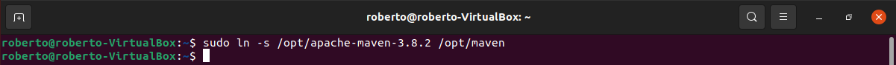

## Establecer variables de entorno
1.	Necesitaremos configurar las variables de entorno. Para esto tenemos que abrir el editor de texto y crear un archivo llamado maven.sh en el directorio etc/profile.d/, para ello usamos el siguiente comando:

```
sudo nano /etc/profile.d/maven.sh
```
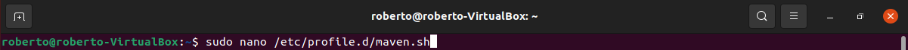

Pega el siguiente código:

```
export JAVA_HOME=/usr/lib/jvm/java-8-openjdk-amd64
 export M2_HOME=/opt/maven
 export MAVEN_HOME=/opt/maven
 export PATH=${M2_HOME}/bin:${PATH}
```
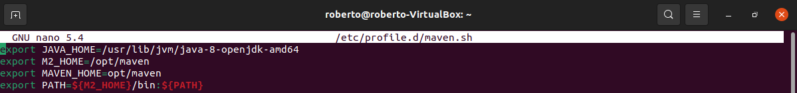

3.	Una vez copiado guardamos y cerramos el fichero, a continuación, tenemos que hacer el que el script sea ejecutable con chmod, para ello usamos el siguiente comando:
```
 sudo chmod +x /etc/profile.d/maven.sh
```
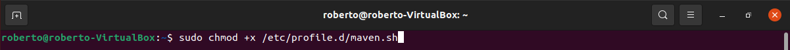
4.	Ahora cargamos las variables de entorno con siguiente comando:
```
 source /etc/profile.d/maven.sh
```
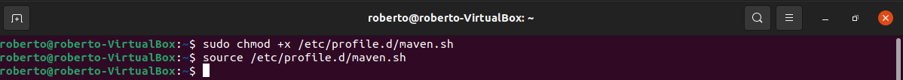

5.	Por último, verificamos la versión instalada de Maven con el siguiente comando:

```
mvn -version
```
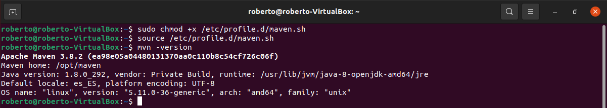
